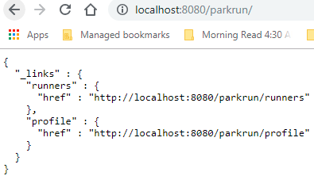
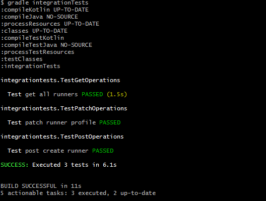

# Kotlin Rest API in Spring-boot, Spring-Data, H2 In-Memory DB
+ This demo project explains REST API development with Kotlin and Spring Boot.

+ Integration Tests are written using [ZeroCode TDD framework](https://github.com/authorjapps)

**_Note:_** <br/>
As Kotlin does the things in less code, so naturally a test framework needed to do the job in less code(almost zero code)

##### Kotlin gradle dependencies
```
	compile('com.fasterxml.jackson.module:jackson-module-kotlin')
	compile("org.jetbrains.kotlin:kotlin-stdlib-jdk8")
	compile("org.jetbrains.kotlin:kotlin-reflect")
```


### Step 1: Building the Application
 We will build the application to generate application jar.
 Integration test cases are skipped because integration tests would expect app is running, so building app first without tests, running the app and then executing integration tests.
 
> gradle clean build -x test

or

> mvn clean install -DskipTests


### Step 2: Running the application


Run from IDE (Right click and run as main):
> com.xp.springboot.kotlin.SpringBootKotlinRestApiApplication

-or-

Open a new git bash and go to the build/libs folder for gadle or /target folder for maven.
 Run below command to run the application

> java -jar SpringBootKotlinRestAPI-0.0.1-SNAPSHOT.jar

Verify the application by accessing below url directly from browser
http://localhost:5000/parkrun/



### Step 3: How to Run Integration Test Cases?
Running the gradle task named "integrationTests". This will run all the test cases defined under this gradle task.
> gradle integrationTests
or

> mvn surefire:test




### Where is the Integration Test Report?
Integration Test report and logs are generated under folder /target/


#### Explore other end points

GET - http://localhost:5000/parkrun/runners

POST - http://localhost:5000/parkrun/runners

Sample request body:
```
 {
        "firstName": "Andy",
        "lastName": "Tey",
        "gender": "M",
        "runningClub": "Swindon"
 }
```
GET - http://localhost:5000/parkrun/runners/2

DELETE - http://localhost:5000/parkrun/runners/2

### A POSt call sample looks like below-
```java
url:http://localhost:5000/parkrun/runners
method:POST

request:
{
  "headers" : {
    "Accept" : "application/hal+json;charset=UTF-8"
  },
  "body" : {
    "firstName" : "Andy",
    "lastName" : "Terris",
    "gender" : "M",
    "runningClub" : "Nanwitch"
  }
} 

Response:
{
  "status" : 201,
  "headers" : {
    "Date" : [ "Fri, 16 Nov 2018 15:27:55 GMT" ],
    "Transfer-Encoding" : [ "chunked" ],
    "Location" : [ "http://localhost:8080/parkrun/runners/5" ],
    "Content-Type" : [ "application/hal+json;charset=UTF-8" ]
  },
  "body" : {
    "firstName" : "Andy",
    "lastName" : "Terris",
    "gender" : "M",
    "runningClub" : "Nanwitch",
    "totalRuns" : "0",
    "_links" : {
      "self" : {
        "href" : "http://localhost:8080/parkrun/runners/5"
      },
      "parkRunner" : {
        "href" : "http://localhost:8080/parkrun/runners/5"
      }
    }
  }
}
```
### Find detailed explanation on 
+ [My blog - Extreme Portal](https://extremeportal.blogspot.com/2018/11/kotlin-dev-spring-boot-rest-api-with.html) 
+ [Dzone Article - Explained in Detail](https://dzone.com/articles/kotlin-spring-bootspring-data-h2-db-rest-api)
